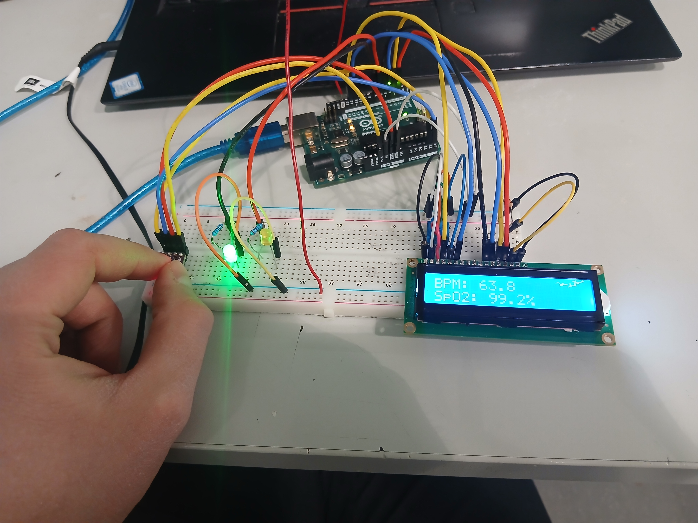

# MAX30102 Pulse Sensor Experiment

This project reads photoplethysmography (PPG) data from a **MAX30102 heart rate sensor** using an **Arduino Uno**.
The Arduino streams the infrared (IR) signal over serial, and a Python script logs the data to a CSV file for analysis.

The goal of the project is to experiment with **heartbeat detection algorithms** using the raw IR time series from the sensor.



## Hardware

* Arduino Uno
* GY-MAX30102 pulse sensor
* USB connection to computer
* 500 ohm resistors 2pcs
* LED 2 pcs
* LCD 1602 
* 220 ohm resistor
* 10k ohm potentiometer
* hook-up wires
* breadboard


### Wiring

| Sensor | Arduino |
| ------ | ------- |
| VIN    | 3.3V    |
| GND    | GND     |
| SDA    | A4      |
| SCL    | A5      |

## Software

Two programs are used:

**Arduino sketch**

* Reads IR samples from the MAX30102
* Sends `time,IR` data over serial

**Python logger**

* Reads the serial stream
* Saves measurements to a CSV file

Example output:

time,IR
0.000,52341
0.010,52355
0.020,52410

## Running the project

1. Upload the Arduino sketch to the board.
2. Connect the sensor and place a finger over it.
3. Run the Python logger:

```
python3 logger.py
```

4. Data will be saved to `pulse.csv`.

## Future work

* Implement heartbeat detection
* Compute BPM from detected peaks
* Visualize pulse waveform

## License

MIT License