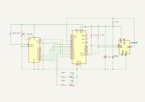

# MAX30102 Pulse Detector Experiment

This project reads photoplethysmography (PPG) data from a **MAX30102 heart rate sensor** using an **Arduino Uno**.
The Arduino streams the infrared (IR) signal over serial, and a Python script logs the data to a CSV file for analysis.

The goal of the project is to experiment with **heartbeat detection algorithms** using the raw IR time series from the sensor.

<figure>
  
  <figcaption>
    <b>Figure 1:</b> The pulse detector device in operation.</i>
  </figcaption>
</figure>

## Hardware

* Arduino Uno
* GY-MAX30102 pulse sensor
* LCD 1602 
* Green LED
* Yellow LED
* USB-A to USB-C cable
* 560 ohm resistors, 2pcs
* 220 ohm resistor
* 10k ohm resistor
* 4.7k ohm resistors, 2 pcs
* 10k ohm potentiometer
* hook-up wires
* breadboard

## Schematic

<figure>
  
  <figcaption>
    <b>Figure 2:</b> The pulse detector schematic.</i>
  </figcaption>
</figure>

## Software Implementation

**Operational Overview**

1. Program reads red and infared samples from the tip of your finger with MAX30102 sensor.
2. Raw samples are processed to remove noise.
3. The processed samples are used to update DC measurements minimum/maximum value readings.
4. The processed samples are then stored in revolving registers and used to calculate Delta readings.
5. Sign changes in reading is used to detect pulse. If no pulse beat is detected, then the program continues at the first step.
6. If a pulse is detected, the the number of samples since the last pulse is recorded. This number corresponds to the pulse signal's period length.
7. The detection of a pulse, indicates the end of the previous period.
8. Minimum and maximum values of of processed samples are used to calculate AC ranges.
9. A period specific SpO2 value is caluclated from AC ranges and DC values.
10. The sample counter, sample minimums and maximums are reset 
5. On the onset of a new period (after a heartbeat is detected) maximum and minimum readings for both ir and red samples are reset.

## Running the Project

1. Build the circuit shown in teh schematic.
1. Connect the arduino to a computer running arduino software. 
2. Upload the sketch to the Arduino Uno with the Arduino IDE
3. Place finger tip on the sensor of the MAX30102.
4. View output of the LCD, LEDs and optionally the serial monitor (and plotter) in the IDE.

## License

MIT License